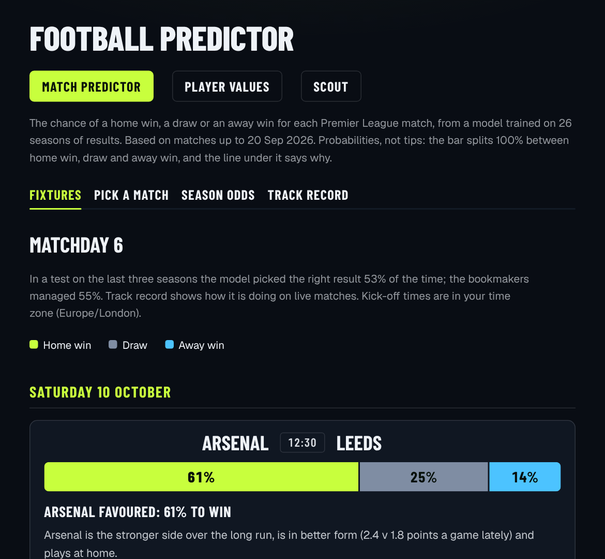
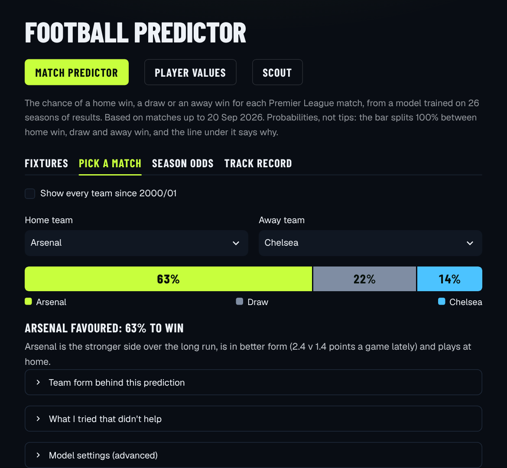
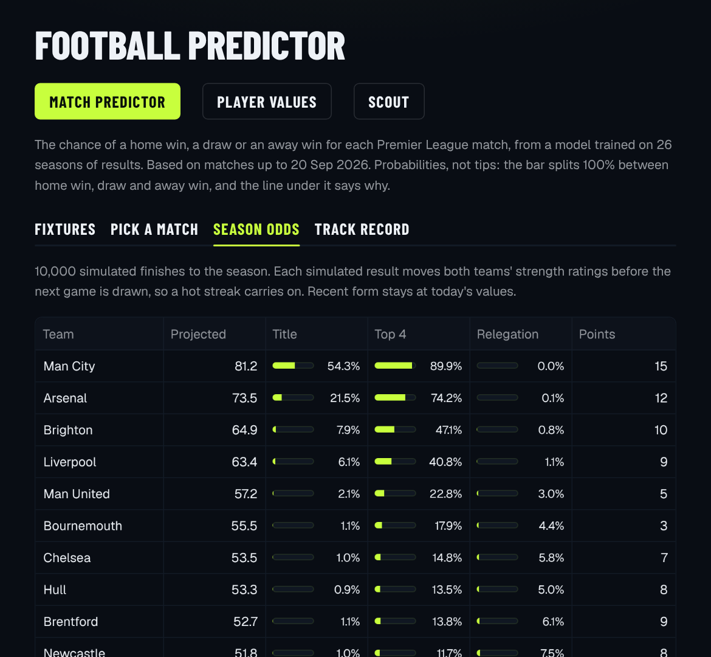
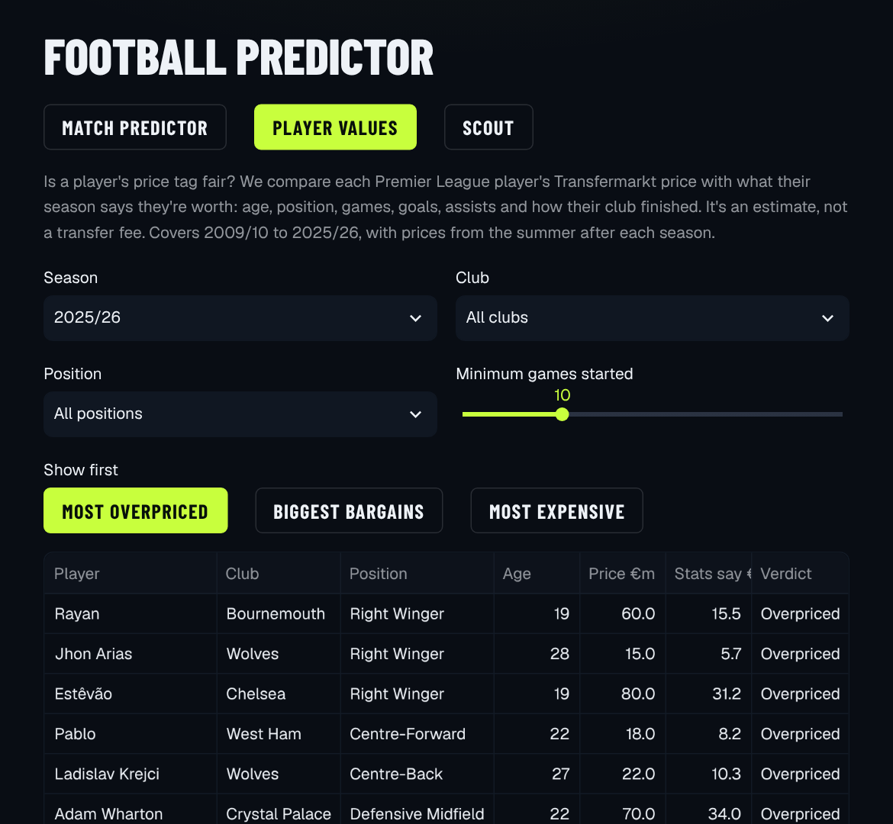
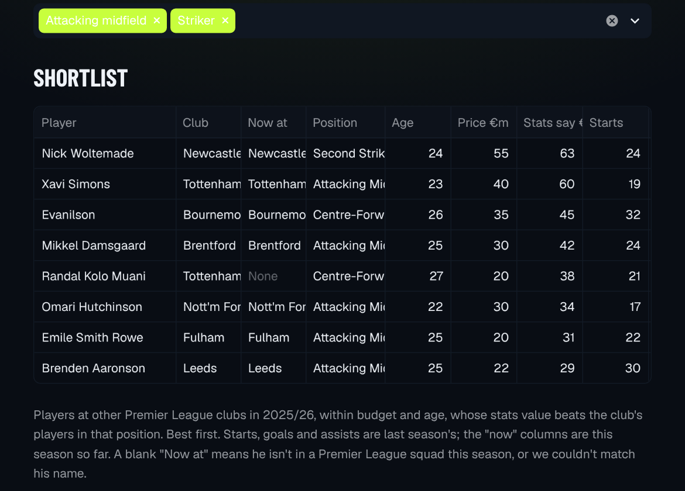

# Premier League predictor

A Streamlit app with three tools: a match predictor, a player value analyser and an AI scout that uses Claude.

**Live app: https://epl-predictor-tension.streamlit.app/**

The short version of the results: the match model beats simple baselines but does not beat the bookmakers. On the last three seasons it scores a log loss of 0.975 against 1.075 for always guessing the usual home/draw/away split, and 0.960 for the bookmakers' closing odds. The player value model's typical estimate is 35% off the market price, against 57% for a simple baseline. Every number below comes from a walk-forward test, where each season is predicted by a model trained only on the seasons before it.



## What's in the app

**Match predictor.** Home win, draw and away win probabilities for the next round of Premier League fixtures, with one plain-English line under each match saying why the model leans the way it does. You can also pick any two teams, see title, top 4 and relegation odds from 10,000 simulated finishes to the season, and follow a live track record. Predictions are logged before kickoff and scored after the final whistle, so that record can't be tuned after the fact.

| Pick a match | Season odds |
|---|---|
|  |  |

**Player values.** For every Premier League player since 2009/10, the app compares the Transfermarkt price with what the player's season says they're worth, and gives a verdict from Bargain to Overpriced. The "stats value" model never sees a market value, so the gap between the two is the interesting part.



**Scout.** Pick a club, a budget and an age limit. The app finds the club's weakest positions by comparing them with the top six, shortlists Premier League players who would be an upgrade and fit the budget, and then Claude writes a scouting report that picks up to three signings from that shortlist, using only the numbers it was given. The shortlist also shows this season's form from Fantasy Premier League and leaves out anyone who has already joined the club.



## Results

### Match predictor

Tested on 2023/24, 2024/25 and 2025/26 (1,140 matches), each season predicted by models trained only on earlier seasons. Lower is better for log loss, Brier and RPS.

| model | log loss | Brier | RPS | accuracy |
|---|---|---|---|---|
| base rate (always the usual H/D/A split) | 1.0745 | 0.6507 | 0.2329 | 43.2% |
| logistic regression, Elo difference only | 0.9852 | 0.5879 | 0.2019 | 53.4% |
| logistic regression, all features | 0.9791 | 0.5839 | 0.1993 | 53.2% |
| XGBoost, all features | 0.9877 | 0.5880 | 0.2010 | 53.3% |
| Dixon-Coles goals model | 0.9787 | 0.5832 | 0.2000 | 52.5% |
| **blend (logistic + Dixon-Coles), used in the app** | **0.9747** | **0.5807** | **0.1984** | 53.3% |
| bookmaker closing odds | 0.9597 | 0.5699 | 0.1938 | 55.0% |

Three things I'd point out:

- **The bookmakers win.** Their closing odds (market average, margin removed, from football-data.co.uk) beat every model on every metric. That's the realistic ceiling for a model built on public results data, so the app says so on the page.
- **XGBoost lost to logistic regression.** With around 9,000 training matches and features that are mostly smooth differences in team strength, the simpler model generalised better.
- **The blend's gain is small and slightly flattering.** The Dixon-Coles time decay was picked on these same three seasons, so the real gain over logistic alone is probably a bit under the 0.004 shown.

The live track record started on 10 October 2026, so it has no scored matches yet. It will be the honest test of whether these numbers hold.

### Player value analyser

Same walk-forward setup, 1,607 player-seasons across 2023/24 to 2025/26.

| model | median error | within 25% of price | variance explained (log value) |
|---|---|---|---|
| median by age band and position | 57% | 21% | 24% |
| **XGBoost on stats and profile** | **35%** | **37%** | **75%** |

A typical estimate is about a third off the market price. Adding last year's market value as a feature cuts the error to about 21%, but then the model mostly repeats last year's price and stops saying anything about the season, so I left it out on purpose.

### What I tried that didn't help

- **Expected goals (xG).** Rolling 5 and 10-match xG from Understat, 2014/15 onwards. Log loss got worse (0.9791 to 0.9847 with all xG columns, 0.9793 with only the 10-match differences), so it was dropped.
- **Injuries.** The share of a club's regular starters missing on match day, from Transfermarkt injury data. No change beyond ±0.001 log loss, and the data stops in December 2025 anyway.
- **Fixture congestion,** including cup and European games. Days of rest since the last league match are already in the model and barely matter (taking them out costs 0.0005 log loss). Congestion counts and short-rest flags moved log loss by less than 0.002 either way.
- **Averaging logistic and XGBoost.** Worse than logistic alone (0.9815).

## How it works

```
football-data.co.uk mirror ─┐
FPL API (this season) ──────┼─► features.py ─► logistic + Dixon-Coles ─► app.py (Streamlit)
openfootball (fallback) ────┘   Elo, form,     blend                     ▲
                                shots                                     │
Transfermarkt datalake ─────► player_value.py (XGBoost) ─► scout.py ─► Claude API
FPL player stats ───────────► form.py (name matching) ─────┘
```

- **Data.** 26 seasons of results (2000/01 to 2025/26, 9,880 matches) with shots, corners and cards. The current season comes from the Fantasy Premier League API, with openfootball as a fallback. Player data is about 10,900 Premier League player-seasons from 2004/05 on.
- **Features** (`src/features.py`). Elo ratings (home advantage, goal-difference multiplier, regression to the mean each summer) and rolling 5 and 10-match averages of points, goals, shots and shots on target, and rest days, all computed only from matches before kickoff. A test checks that no feature can see the match it's predicting.
- **Models** (`src/evaluate.py`, `src/dixoncoles.py`). Multinomial logistic regression and a Dixon-Coles Poisson goals model with time decay, averaged 50/50.
- **Season simulation** (`src/simulate.py`). Monte Carlo of the remaining fixtures, with Elo updated after each simulated result so a hot streak carries on.
- **Player values** (`src/player_value.py`). XGBoost on age, position, appearances, starts, goals, assists, European games and the club's league finish. The target is log value relative to that summer's median, so transfer inflation doesn't dominate.
- **Scout** (`src/scout.py`). Squad needs and the shortlist are plain pandas. Only the final report calls Claude, and it is told to pick only from the shortlist and back each pick with the numbers given. Reports are cached and capped at 20 new ones a day for the whole site, since the API key is mine and the site is public.
- **Automation.** GitHub Actions runs the 43 tests on every push, and a daily job pulls new results and FPL stats, logs predictions for the next round and commits them back, so the live app keeps itself up to date.

## Run it yourself

```
pip install -r requirements.txt
streamlit run app.py                         # the app (trains its models on start, about 10 s)
python -m src.evaluate                       # match model metrics -> results/
python -m src.player_value                   # player value metrics -> results/
python -m src.predict Arsenal Chelsea        # HOME AWAY pairs
pytest                                       # tests
python scripts/fetch_current_season.py       # refresh this season's results
```

The Scout report needs an Anthropic API key: put `ANTHROPIC_API_KEY = "..."` in `.streamlit/secrets.toml` (git-ignored), or under Settings → Secrets on Streamlit Community Cloud. Everything else works without one.

Team names follow football-data.co.uk spelling ("Man City", "Man United", "Nott'm Forest", "Tottenham").

<details>
<summary>Data sources and their limits</summary>

- **Results, 2000/01 to 2025/26:** the [datasets/football-datasets](https://github.com/datasets/football-datasets) mirror of football-data.co.uk. Results plus shots, shots on target, corners, fouls and cards. No lineups or injuries.
- **Current season:** the Fantasy Premier League API, which posts scores within hours. If it can't be reached, [openfootball](https://github.com/openfootball/football.json), which can lag a week or more. Both have scores only, so shots form uses each team's latest matches that have shot data. All 380 openfootball results for 2024/25 match the mirror.
- **Bookmaker odds:** closing odds for the three test seasons from football-data.co.uk, used only as a benchmark. They can't be a feature because the fixture feed has none for upcoming matches.
- **Players, 2004/05 to 2024/25:** the Transfermarkt datalake at [salimt/football-datasets](https://github.com/salimt/football-datasets). Its minutes column is missing for over half the rows, so starts stand in.
- **Players, 2025/26:** the [dcaribou/transfermarkt-datasets](https://github.com/dcaribou/transfermarkt-datasets) snapshot (values to June 2026), fetched by the "player snapshot" workflow. Its updates are paused, so summer 2026 is the latest price. 2025/26 is the hardest test season (39% median error), partly because this source leaves out a few minor competitions the datalake counts.
- **This season's player form:** FPL, matched to our players by name (FPL often uses full legal names). 403 of the 537 2025/26 players match, and most of the rest have left the league. FPL has no market values.
</details>

<details>
<summary>Project layout</summary>

```
app.py               Streamlit page (style in the CSS block at the top and .streamlit/config.toml)
src/features.py      Elo ratings and rolling form, built only from past matches
src/evaluate.py      walk-forward evaluation of the match models
src/dixoncoles.py    Dixon-Coles goals model and the blend with logistic
src/predict.py       probabilities and plain-English explanations for any fixture
src/fixtures.py      next round and full season of fixtures (FPL, else openfootball)
src/simulate.py      Monte Carlo of the rest of the season
src/tracker.py       logs predictions before kickoff and scores them afterwards
src/player_value.py  stats value vs Transfermarkt market value
src/form.py          matches this season's FPL players to ours
src/scout.py         squad needs, shortlist and the Claude scouting report
src/quota.py         site-wide daily cap on new scouting reports
scripts/             data downloads, FPL and odds fetches, prediction logging
.github/workflows/   ci.yml (tests), refresh.yml (daily data), player-snapshot.yml (manual)
data/raw/            season CSVs, 2000/01 to the season in progress
data/players/        player-seasons and this season's FPL stats
data/odds/           closing odds for the test seasons (benchmark only)
results/             metrics, per-match test predictions, predictions_log.csv (live track record)
tests/               leakage, Elo, fetch, simulation, tracker, player value and scout tests
docs/screenshots/    images in this README
```
</details>

## Licence

MIT. These are model probabilities, not betting tips.
